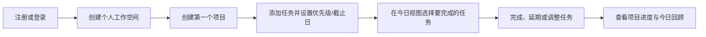

# 01｜产品需求文档（PRD）

## 1. 用户与使用情境

**目标用户：** 想管理个人项目、学习计划或副业目标的个人使用者。  
**核心情境：** 用户打开产品时，希望迅速确认今日重点，而不是面对密集表格或复杂配置。

## 2. 核心用户旅程

## 3. MVP 功能需求

| 编号 | 需求 | 验收说明 |
| --- | --- | --- |
| FR-AUTH-001 | 用户可用邮箱和密码注册账号 | 邮箱唯一；密码不以明文保存；注册成功后进入引导页。 |
| FR-AUTH-002 | 用户可登录、退出并在刷新页面后保持登录 | 无效凭证返回清晰错误；退出后令牌失效。 |
| FR-PROJECT-001 | 用户可创建、查看、编辑和归档项目 | 项目至少包含名称、色彩和可选描述。 |
| FR-TASK-001 | 用户可为项目创建、编辑、完成和删除任务 | 必填标题；支持描述、状态、优先级、截止日。 |
| FR-TASK-002 | 用户可调整任务状态与排序 | 支持待开始、进行中、已完成；拖拽为增强体验，按钮操作为可访问性兜底。 |
| FR-TODAY-001 | 用户可在“今日”查看当天到期、逾期和手动加入的任务 | 每项任务均可完成、延期或移出今日。 |
| FR-INSIGHT-001 | 用户可查看今日完成数、逾期任务数和项目完成度 | 数据与任务状态一致；空状态有明确下一步操作。 |

## 4. 主要页面

| 页面 | 目的 | 核心操作 |
| --- | --- | --- |
| 欢迎 / 登录 | 建立或恢复账号会话 | 注册、登录、密码校验 |
| 首次引导 | 在空白状态下快速开始 | 创建项目、添加首项任务 |
| 今日 | 聚焦当天行动 | 完成、延期、调整优先级 |
| 项目总览 | 浏览项目及进度 | 创建、归档、进入项目 |
| 项目详情 | 管理项目中的任务 | 新建、编辑、改变状态、排序 |
| 任务详情 | 编辑完整任务信息 | 修改内容、日期、标签、完成状态 |
| 设置 | 管理个人偏好 | 个人资料、主题、退出登录 |

## 5. 业务规则

1. 每个用户在注册后自动拥有一个个人工作空间。
2. 归档项目默认不在项目总览展示，且不可新增任务；历史任务仍可查看。
3. 任务删除为软删除，30 天内可在后续版本恢复；MVP 前端不提供恢复页。
4. 任务完成时写入完成时间；重新打开任务时清空完成时间。
5. “今日”包含截止日为当天或早于当天的未完成任务，以及用户主动置顶的任务。

## 6. 非功能需求

- 页面首屏在普通宽带下应快速可交互；避免使用大尺寸无意义资源。
- 所有写操作均需登录；用户不可访问其他用户的数据。
- 手机宽度下核心流程可单手完成；桌面端支持键盘导航。
- 网络、空数据和权限错误均有可理解的状态反馈。

## 7. 后续路线图（非 MVP）

1. 任务评论、附件与项目模板。
2. 工作空间成员、邀请与角色。
3. 周报、日历和数据导出。
4. PWA、推送通知和第三方日历同步。
