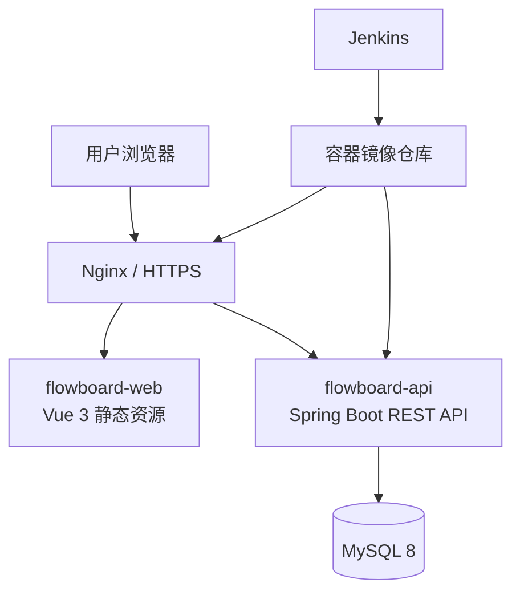

# 02｜系统与结构设计

## 1. 总体架构

FlowBoard 采用前后端分离的模块化单体架构。浏览器加载独立部署的 Vue 静态应用；应用通过 HTTPS 调用 Spring Boot API；后端负责认证、业务规则和数据库访问。



## 2. 仓库边界

| 仓库 | 职责 | 不应包含 |
| --- | --- | --- |
| `flowboard-web` | Vue 页面、设计令牌、前端测试、Web 镜像定义 | Java 业务代码、生产密钥 |
| `flowboard-api` | REST API、数据库迁移、后端测试、API 镜像定义 | 前端打包产物、生产密钥 |
| `flowboard-docs` | 跨端需求、契约、架构、验收与运维说明 | 可部署镜像、密码、令牌 |

生产 Compose/Nginx 模板初期放在 `flowboard-api/deploy/`，待第一轮发布稳定后抽取为 `flowboard-infra`。真实 `.env` 始终只保留在服务器或 Jenkins 凭据中。

## 3. 技术选择

| 层 | 技术 | 说明 |
| --- | --- | --- |
| Web | Vue 3、TypeScript、Vite | 组件化 C 端应用与快速本地开发。 |
| 样式 | Tailwind CSS、自定义 CSS 变量 | 设计令牌和高度可控的响应式样式。 |
| 基础交互 | Radix Vue | 仅使用无样式、可访问的 Dialog、Menu、Popover 等原语。 |
| 后端 | Java 21、Spring Boot、Spring Security、MyBatis-Plus | REST API、鉴权、验证和数据持久化。 |
| 数据库 | MySQL 8、Flyway | 关系数据与可版本化的结构迁移。 |
| 交付 | Docker、Docker Compose、Nginx、Jenkins | 本地复现、镜像交付和自动部署。 |

## 4. 后端模块边界

```text
api/
├── auth/          # 注册、登录、令牌与当前用户
├── workspace/     # 个人工作空间
├── project/       # 项目生命周期
├── task/          # 任务、状态、排序与今日视图
├── insight/       # 聚合统计
└── shared/        # 异常、审计、校验、统一响应
```

模块通过应用层服务协作，不直接跨模块操作 Mapper。接口先保持 REST；无实际需求前不引入消息队列或微服务。

## 5. 持久层约定

- 使用 MyBatis-Plus 的 `BaseMapper` 完成明确、简单的单表 CRUD；Controller 不得直接调用 Mapper。
- 需要多表查询、统计、复杂筛选或性能调优时，使用语义明确的 Mapper 方法和 XML SQL，不把复杂 `Wrapper` 链堆进 Service。
- 表结构以 Flyway 迁移脚本为准；实体映射、逻辑删除、分页拦截器和审计字段在应用启动时统一配置。
- 所有查询显式控制返回字段和排序；禁止依赖 `select *` 或未限定条件的批量更新/删除。

## 6. 安全与配置

- 密码使用强哈希算法保存；令牌密钥仅来自环境变量。
- API 使用短期 access token 与可撤销 refresh token；具体令牌策略在实现阶段补充。
- 所有资源查询按当前用户和工作空间过滤，不能只依赖前端隐藏。
- Flyway 自动校验迁移顺序；生产数据库不允许手工改表。
- API 通过 `/actuator/health` 提供健康检查，Jenkins 部署后据此决定成功或回滚。

## 7. 架构验收

- 前端和后端可独立启动、独立构建、独立部署。
- 前端仅能通过公开 API 访问数据；数据库不暴露给浏览器。
- 无密钥、个人数据或构建产物被提交到 Git。
