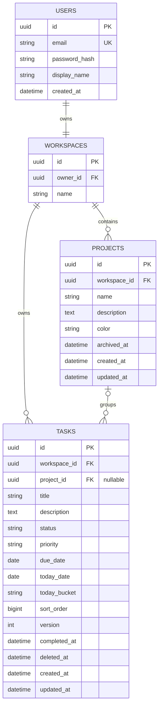

# 03｜数据模型与 API 契约

## 1. 数据模型（MVP）



所有主键使用 UUID。任务即使暂未归入项目，也必须属于当前工作空间；`project_id` 因此允许为空。`status` 是任务工作流状态（`TODO`、`IN_PROGRESS`、`DONE`），`today_bucket` 是 Today 页面当天的显示分组（`FOCUS`、`PLAN`、`LATER`），二者不能混用。时间以 UTC 保存、由前端按用户时区显示；日期型截止日和 `today_date` 按用户本地日期解释。标签与任务标签关系不属于 M4 首批实现，后续以独立迁移加入。

## 2. REST 约定

- 基础路径：`/api/v1`。
- JSON 字段使用 `camelCase`；日期使用 `YYYY-MM-DD`，时间使用 ISO 8601。
- 写操作必须带 `Authorization: Bearer <access-token>`。
- 成功响应直接返回资源；列表返回 `items`、`page`、`pageSize`、`total`。
- 错误统一返回 `code`、`message`、`traceId` 与可选 `fieldErrors`。

```json
{
  "code": "VALIDATION_ERROR",
  "message": "请求参数不合法",
  "traceId": "01J...",
  "fieldErrors": [{ "field": "title", "message": "任务标题不能为空" }]
}
```

## 3. 第一批接口

| 方法 | 路径 | 需求 | 说明 |
| --- | --- | --- | --- |
| `POST` | `/auth/register` | FR-AUTH-001 | 创建账号与默认工作空间。 |
| `POST` | `/auth/login` | FR-AUTH-002 | 返回 access / refresh token。 |
| `POST` | `/auth/refresh` | FR-AUTH-002 | 刷新 access token。 |
| `GET` | `/me` | FR-AUTH-002 | 获取当前用户与工作空间摘要。 |
| `GET, POST` | `/projects` | FR-PROJECT-001 | 列表与创建项目。 |
| `GET, PATCH` | `/projects/{projectId}` | FR-PROJECT-001 | 查询与编辑项目。 |
| `POST` | `/projects/{projectId}/archive` | FR-PROJECT-001 | 归档项目；可撤销。 |
| `POST` | `/projects/{projectId}/restore` | FR-PROJECT-001 | 恢复归档项目。 |
| `GET` | `/projects/{projectId}/tasks` | FR-TASK-001 | 查看某项目的任务。 |
| `GET, POST` | `/tasks` | FR-TASK-001 | 查询、创建任务；项目可选。 |
| `GET, PATCH, DELETE` | `/tasks/{taskId}` | FR-TASK-001 | 查询、编辑、软删除任务。 |
| `POST` | `/tasks/{taskId}/complete` | FR-TASK-001 | 完成任务。 |
| `POST` | `/tasks/{taskId}/reopen` | FR-TASK-001 | 重新打开任务。 |
| `PATCH` | `/tasks/{taskId}/today-placement` | FR-TODAY-001 | 加入、调整或移出当天分组。 |
| `PATCH` | `/tasks/reorder` | FR-TASK-002 | 调整 Today 分组及排序。 |
| `GET` | `/today` | FR-TODAY-001 | 今日、逾期、手动安排与已完成任务。 |
| `GET` | `/insights/overview` | FR-INSIGHT-001 | 今日与项目统计。 |

## 4. 跨仓库变更规则

1. 后端先发布向后兼容的字段或接口，再发布使用它的前端。
2. 删除字段至少经历“停止写入 → 前端不再读取 → 一个发布周期后删除”三步。
3. OpenAPI 定义由后端生成并发布；前端在 CI 中校验关键请求/响应模型。
4. 破坏性变化必须先更新本文件、创建迁移计划，并在 PR 中关联需求编号。
