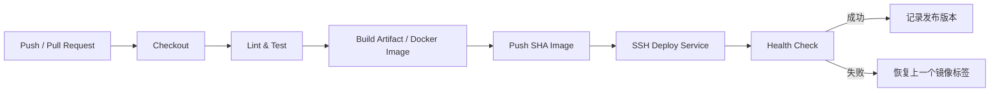

# 05｜交付与 DevOps 方案

## 1. Git 工作流

| 项目 | 规则 |
| --- | --- |
| 主分支 | `main` 始终保持可部署；仅通过 Pull Request 合并。 |
| 工作分支 | `feat/<issue>-
`、`fix/<issue>-
`、`chore/
`。 |
| 提交 | 提交信息统一使用中文并保留类型前缀，例如 `功能(任务)：添加今日置顶`。 |
| 关联 | PR、提交、测试记录关联需求编号，如 `FR-TASK-001`。 |
| 标签 | 部署镜像使用 Git SHA；稳定版本再增加语义化版本标签。 |

## 2. 环境与配置

| 环境 | 用途 | 配置来源 |
| --- | --- | --- |
| local | 开发和联调 | `.env.example` + 本地未跟踪的 `.env` |
| staging（可选） | 云端预发布验证 | Jenkins 凭据 + 服务器环境文件 |
| production | 对外服务 | Jenkins 凭据 + 服务器环境文件 |

仓库只提交 `.env.example`，绝不提交真实密钥。Jenkins 中的 SSH 私钥、镜像仓库凭据、JWT 密钥和数据库密码均使用 Credentials 管理。

## 3. CI/CD 流程

### `flowboard-web` Pipeline

1. 安装锁定依赖。
2. 运行类型检查、lint、单元测试。
3. 构建静态文件并构建 Nginx 镜像。
4. 推送 `web:<git-sha>` 镜像。
5. 在目标主机仅更新 `web` 服务，并检查首页和 `/healthz`。

### `flowboard-api` Pipeline

1. 执行 Maven 测试、静态检查和打包。
2. 构建 `api:<git-sha>` 镜像并推送。
3. 在目标主机仅更新 `api` 服务。
4. 等待 `/actuator/health` 返回 `UP`；失败则恢复上一个 API 镜像。

## 4. 生产部署原则

- 所有服务通过 Docker Compose 管理，MySQL 使用命名卷持久化。
- Nginx 终止 HTTPS，并将 `/api/` 反向代理到 API 服务。
- 数据库迁移随 API 版本运行；破坏性迁移需要备份和人工确认。
- 部署脚本必须幂等；禁止 Jenkins 用 root 用户直接运行。
- 每次发布记录 Git SHA、镜像标签、时间、执行人和健康检查结果。

## 5. 观测与恢复

- 服务器保留容器日志，并限制日志文件大小。
- 监控最少覆盖 API 健康、磁盘空间、容器重启次数和 HTTPS 证书有效期。
- 发生故障时，先检查最近发布版本、容器状态和应用日志；优先回滚镜像而非在线修改容器。
