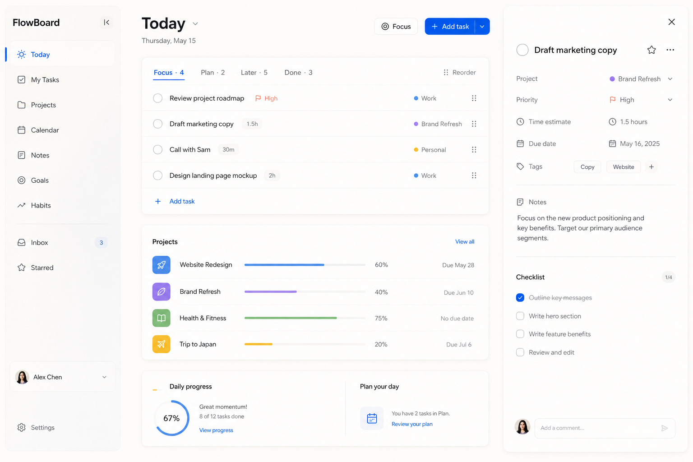

# 09｜视觉方向与界面参考

## 1. 视觉方向稿 v1

这张图由 GPT 图像生成能力创建，用于确定信息层级、留白、色彩和整体气质。它不是可直接上线的页面，也不是像素级设计稿：真实页面将依据 PRD、详细设计和可访问性规范以 Vue 组件实现。

## 2. 保留与调整

| 方向稿中的元素 | 处理方式 |
| --- | --- |
| 暖白画布、深色文字、蓝色主操作 | 保留，作为初始色彩语言。 |
| 左侧轻量导航、中央今日任务、右侧详情 | 保留为桌面信息架构参考。 |
| 浮层的柔和阴影与克制半透明 | 保留，但仅用于工具栏、弹层和详情面板。 |
| `Calendar`、`Notes`、`Goals`、`Habits` 等导航 | 不属于 MVP，暂不实现。 |
| 英文文案、样例头像、评论区域、时间估算 | 仅为视觉占位，不作为 MVP 需求。 |
| 完成度圆环 | 可作为后续洞察组件；MVP 先以简单文字/进度条表达。 |

## 3. 三个需要实现的关键界面

1. **Today（桌面端）**：任务分组、项目摘要与右侧任务详情，体现主视觉方向。
2. **项目详情（桌面端）**：项目概况、任务列表/看板、创建与排序状态。
3. **Today（移动端）**：底部导航、任务列表和可拖拽任务详情抽屉。

这三张界面会先以可运行的前端原型实现，再根据实际交互迭代；不以静态图片替代交互原型。

## 4. Figma 的使用决策

**当前不需要连接 Figma。** 对单人项目，先以本仓库的规范、方向稿和可运行 Vue 原型做决策更高效。

在以下情况再引入 Figma：需要多人协作评审；要维护大量可复用的视觉组件；需要向非开发参与者交付可编辑设计稿；或需要在开发前快速比较多个完整页面方案。

如后续引入，Figma 只保存设计资产和可编辑稿，不替代本仓库的需求、接口与验收文档。
