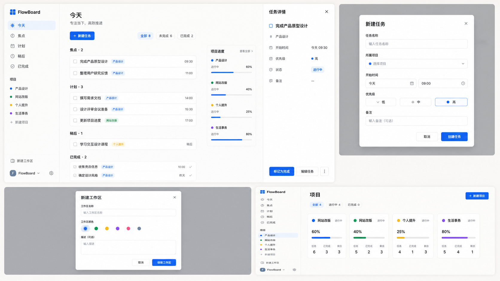
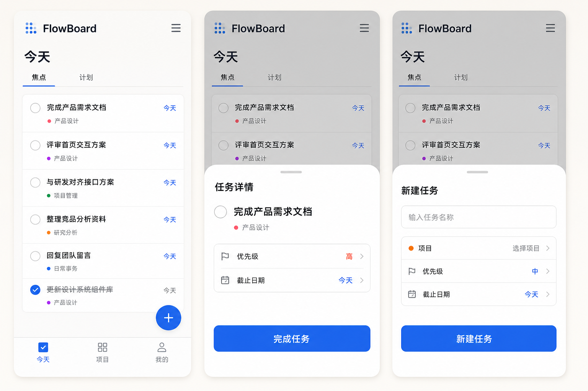
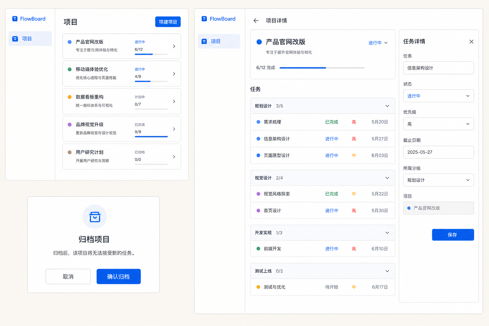
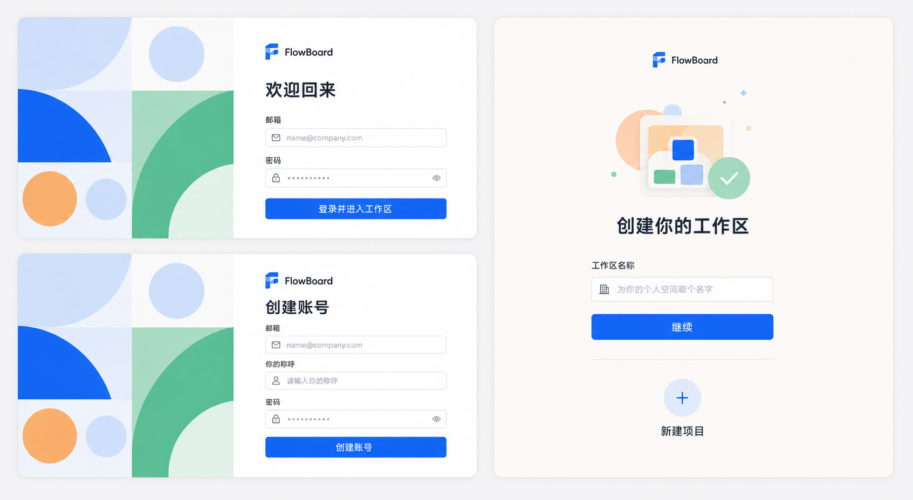

# 09｜视觉方向与界面参考

## 1. 已确认的视觉方向（v2）

FlowBoard 采用“平静、高效、面向个人”的 C 端工作台视觉：暖灰画布承托白色内容面板，近黑文字建立信息层级，`#2463EB` 只用于主操作、选中态与关键进度。界面避免后台管理式的深色大区块、重边框和密集表格。

以下四张 AI 生成图是**版本化的视觉参考资产**。它们用于统一结构、比例和氛围；功能、字段、状态与交互以 PRD、详细设计和实现验收为准。

### 1.1 桌面端主方向：Today 工作区

**已确认：以此图作为桌面端主方向。** 保留左侧导航、中央“今天”任务流、按需打开的右侧任务详情，以及轻量项目概览。创建任务与创建工作区仅在用户触发时以弹层出现，不常驻占用页面空间。

### 1.2 移动端主方向：任务流与底部抽屉

**已确认：以此图作为移动端主方向。** 手机端使用底部导航；任务详情和新建任务使用从底部出现的抽屉，主操作放在拇指易达区域。抽屉支持手势拖拽、点击遮罩和 Esc/返回关闭。

### 1.3 项目相关页面

项目总览、项目详情和归档确认沿用同一套白色面板、项目色点缀与克制层级。项目色仅用于识别，不作为正文文字的唯一对比来源；归档为可撤销动作，优先 Toast 撤销而不是打断式确认。

### 1.4 品牌标识与认证/引导

**已确认：采用此图的 Logo 方向。** 标识为由深浅蓝色块构成的简洁几何 “F”，旁边配合 `FlowBoard` 字标。实现时优先使用可缩放的本地 SVG；不得将生成图中的位图 Logo 直接裁切为生产资源。

认证页保留左侧几何拼贴与右侧紧凑表单的比例；无 Google 等第三方快捷登录、无“登录 FlowBoard”眉题、无“返回首页”链接。首次使用只要求填写工作区名称，后续项目可跳过或稍后创建。

## 2. 明确取舍

| 决策 | 结论 |
| --- | --- |
| 桌面信息架构 | 采用“左侧导航 + 中央任务流 + 按需右侧详情”的第 1 张方案。 |
| 移动交互 | 采用第 2 张的底部导航和底部抽屉，不把桌面右栏硬缩到手机。 |
| 品牌标识 | 采用第 4 张的蓝色几何 F 方向，作为后续 SVG Logo 的设计基线。 |
| 主色 | `#2463EB`；黑色只用于文字与图标，不作为主操作按钮底色。 |
| 页面语言 | MVP 只交付简体中文；保留国际化架构，但不展示语言切换。 |
| 非目标 | 不实现 Google/社交登录、复杂日历、笔记、习惯、评论、工时估算等非 MVP 能力。 |

## 3. 参考资产的使用规则

1. 生产页面按 [14-design-screen-spec.md](14-design-screen-spec.md) 中的页面和组件规范实现，不以图片像素描摹替代响应式设计。
2. 视觉资产的任何替换或新增，必须更新本文件的版本号、文件名和决策说明。
3. Logo 在实现前应先输出 SVG 源文件及单色、小尺寸可读性检查，再接入导航和认证页。
