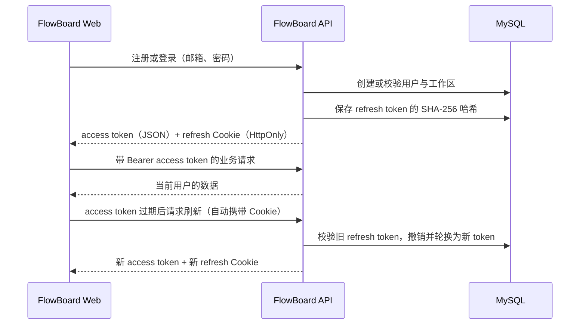

# 11｜M2：认证与 MySQL 基础设计

## 1. 阶段目标

M2 为 FlowBoard 建立真实的用户身份与数据归属边界：用户可以注册、登录、刷新会话、退出并读取自己的工作区。所有数据库迁移与集成测试都以 MySQL 8 为准，不使用 H2。

本阶段不实现项目、任务、邮件验证、找回密码、社交登录或多工作区切换。

## 2. 认证流程



### 令牌约定

- access token 是 HS256 签名 JWT，默认有效期 15 分钟，只放在前端运行内存中。
- refresh token 是高熵随机值，默认有效期 30 天；浏览器只通过 `HttpOnly`、`SameSite=Lax` Cookie 保存和发送。
- 服务端只保存 refresh token 的 SHA-256 哈希、过期时间和撤销时间；泄露数据库不应直接换取登录态。
- 刷新时轮换 token：旧记录先撤销，再创建新记录。退出登录会撤销当前 token 并清除 Cookie。
- JWT 签名密钥仅由运行环境提供，长度至少 256 bit；不得写入 Git、日志或响应。

## 3. 数据库迁移

### V001：用户与工作区

| 表 | 字段 | 规则 |
| --- | --- | --- |
| `users` | `id` | `CHAR(36)` UUID 主键 |
|  | `email` | `VARCHAR(254)`，小写规范化后唯一 |
|  | `password_hash` | BCrypt 哈希，绝不保存明文 |
|  | `display_name` | 1–50 字符 |
|  | `created_at`、`updated_at` | UTC `DATETIME(6)` |
| `workspaces` | `id` | `CHAR(36)` UUID 主键 |
|  | `owner_id` | 外键关联 `users.id`，唯一；MVP 每用户一个工作区 |
|  | `name` | 注册时固定初始化为“我的工作区” |
|  | `created_at`、`updated_at` | UTC `DATETIME(6)` |

### V002：刷新令牌

| 字段 | 规则 |
| --- | --- |
| `id` | `CHAR(36)` UUID 主键 |
| `user_id` | 外键关联用户，便于一次撤销该用户全部会话 |
| `token_hash` | `CHAR(64)`，SHA-256 十六进制值，唯一 |
| `expires_at` | UTC 过期时间 |
| `revoked_at` | 可空；非空即不可再使用 |
| `created_at` | UTC 创建时间 |

Flyway 是唯一的建表方式。迁移一旦进入共享环境不得修改，只能新增后续版本。

## 4. API 契约

| 方法 | 路径 | 认证 | 成功响应 |
| --- | --- | --- | --- |
| `POST` | `/api/v1/auth/register` | 否 | `201`、用户、工作区、access token，并设置 refresh Cookie |
| `POST` | `/api/v1/auth/login` | 否 | `200`、用户、工作区、access token，并设置 refresh Cookie |
| `POST` | `/api/v1/auth/refresh` | refresh Cookie | `200`、新的 access token，并轮换 Cookie |
| `POST` | `/api/v1/auth/logout` | refresh Cookie（可选） | `204`，撤销会话并清除 Cookie |
| `GET` | `/api/v1/me` | Bearer access token | `200`、当前用户与工作区 |

注册请求：

```json
{
  "email": "dylan@example.com",
  "password": "至少 8 个字符的密码",
  "displayName": "Dylan"
}
```

`register`、`login`、`refresh` 的 JSON 响应均包含 `accessToken`、`tokenType`（固定为 `Bearer`）、`expiresIn`（秒）以及必要的用户和工作区摘要。refresh token 永远不出现在 JSON、日志或前端状态中。

## 5. 失败语义

| 场景 | HTTP | 错误码 | 对用户的信息 |
| --- | --- | --- | --- |
| 邮箱已注册 | `409` | `EMAIL_ALREADY_EXISTS` | 该邮箱已注册 |
| 登录邮箱或密码不匹配 | `401` | `UNAUTHENTICATED` | 邮箱或密码不正确 |
| 缺失、过期、篡改 access token | `401` | `UNAUTHENTICATED` | 登录已失效，请重新登录 |
| 缺失、过期、已撤销 refresh token | `401` | `UNAUTHENTICATED` | 登录已失效，请重新登录 |
| 请求字段格式不合法 | `400` | `VALIDATION_ERROR` | 指向具体字段 |

所有错误响应遵循既定的 `code`、`message`、`traceId` 和可选 `fieldErrors` 格式。安全过滤器产生的 `401/403` 也必须返回同一格式。

## 6. 实现与测试边界

- Controller 只做请求校验、写入 Cookie 和 HTTP 响应；注册、登录、刷新在 Application Service 内以事务执行。
- 通过 MyBatis-Plus `BaseMapper` 实现用户、工作区、refresh token 的单表访问；不在 Controller 直接调用 Mapper。
- 用 `@Mapper` 标记 Mapper，避免扫描范围与隐式配置不清晰。
- 集成测试用 Testcontainers 启动 `mysql:8.4`，由 Flyway 创建空库结构，并覆盖注册、重复注册、登录、读取 `/me`、刷新和未认证访问。
- 本机没有 Docker 时，集成测试会明确跳过；M4 安装 Docker 后与 Jenkins 中必须实际执行。

## 7. 完成定义

1. 空 MySQL 可自动执行 V001、V002 并成功启动 API。
2. 注册会原子地创建用户、个人工作区和可用会话。
3. 登录、刷新、退出与 `/me` 满足上表的状态码与安全语义。
4. 刷新令牌不出现在 JSON，不以明文保存至数据库。
5. MySQL Testcontainers 集成测试通过；无 Docker 环境下明确跳过而不回退到 H2。
