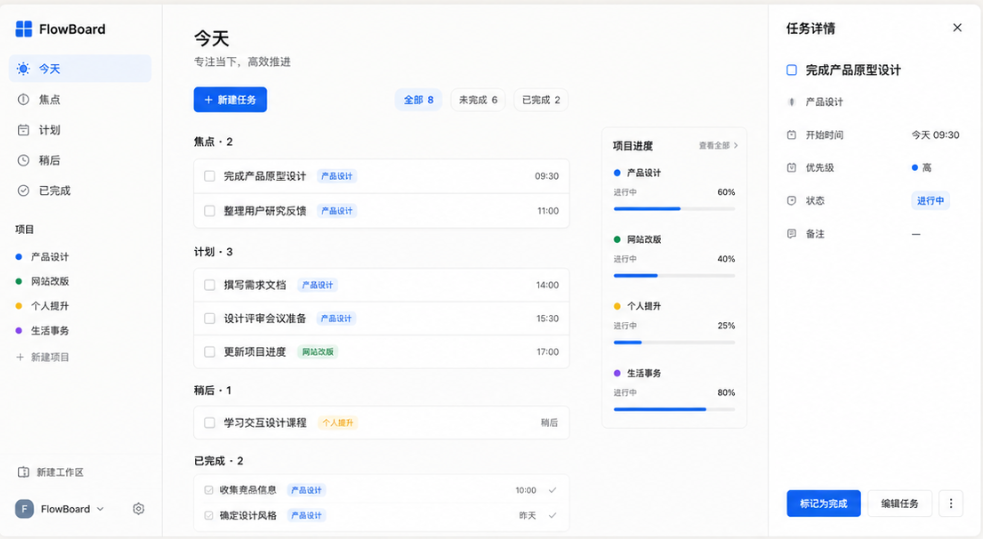
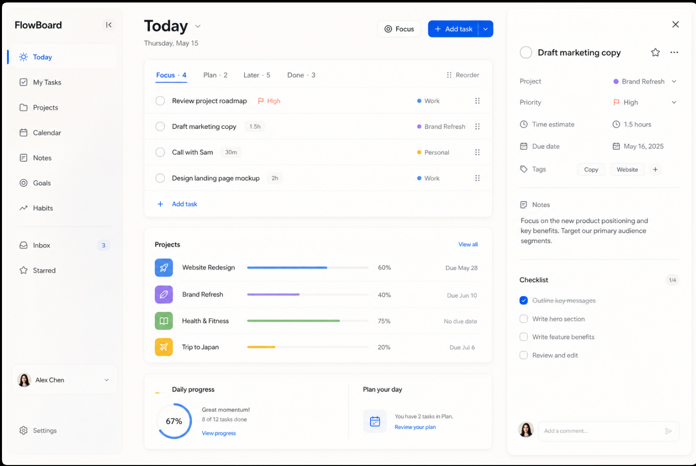

# 15｜M4：项目、任务与 Today 详细设计

## 1. 阶段目标

M4 将已登录后的空状态工作区替换为真实、可持久化的项目与任务工作台。当前 `TodayView` 只是 M3 认证纵向切片的展示骨架，**不作为最终主界面验收标准**；M4 完成后以本文件的结构、行为和接口契约为准。

本阶段覆盖：项目、任务、Today、任务详情、新建任务，以及桌面/手机的基础适配。它不实现日历、笔记、目标、习惯、收件箱、评论、清单、工时估算、附件或多人协作。

## 2. 视觉参考与取舍





| 参考内容 | M4 决策 |
| --- | --- |
| 图 1 的中文侧栏、任务分组、项目进度、右侧详情 | 作为 M4 的信息架构。 |
| 图 2 的留白、白色面板、任务行密度和按需详情栏 | 作为 M4 的版式与层级参考。 |
| 参考图中的日历、笔记、习惯、收件箱、星标、评论、清单、工时 | 不属于 MVP，不实现，也不预留空入口。 |
| 参考图中的样例任务 | 只说明信息密度；生产页面仅显示用户创建并保存的真实数据。 |

沿用 [09-visual-direction.md](09-visual-direction.md) 的暖灰画布、白色面板、蓝色主操作与几何 F 标识。主按钮使用 `#2463EB`，近黑仅用于文字与图标，不能用作主操作底色。

## 3. 领域模型与业务规则

### 3.1 项目

| 字段 | 规则 |
| --- | --- |
| `id` | UUID。 |
| `workspaceId` | 当前用户唯一工作空间，服务端从登录态确定，不接受客户端伪造。 |
| `name` | 必填，1–60 个字符。 |
| `description` | 可选，最多 1,000 个字符。 |
| `color` | 必填，限定 `BLUE`、`VIOLET`、`GREEN`、`AMBER`、`ROSE` 五种语义色。 |
| `archivedAt` | 为空表示活跃；有值表示归档。 |

项目归档后不可创建、修改、完成或重开其任务；历史任务仍可读取。归档使用可撤销操作：接口返回归档结果，前端 Toast 提供“撤销”，由恢复接口完成。

### 3.2 任务

| 字段 | 规则 |
| --- | --- |
| `id`、`workspaceId` | UUID；服务端始终按当前工作空间过滤。 |
| `projectId` | 可选；空值表示收集箱任务，可在 Today 中管理。 |
| `title` | 必填，1–160 个字符。 |
| `description` | 可选，最多 10,000 个字符。 |
| `status` | 工作流状态：`TODO`、`IN_PROGRESS`、`DONE`。 |
| `priority` | `NONE`、`LOW`、`MEDIUM`、`HIGH`；默认 `NONE`。 |
| `dueDate` | 可选本地日期，格式 `YYYY-MM-DD`。 |
| `todayDate` | 可选本地日期；表示用户主动安排到哪一天。 |
| `todayBucket` | 当 `todayDate` 有值时可为 `FOCUS`、`PLAN`、`LATER`；否则为空。 |
| `sortOrder`、`version` | 服务端排序与乐观锁字段；客户端更新时提交 `version`。 |
| `completedAt`、`deletedAt` | 完成和软删除时间；对用户不暴露已删除任务。 |

完成任务时服务端同时将 `status` 设为 `DONE`、写入 `completedAt`；重开时将状态改为 `TODO`、清空 `completedAt`。`FOCUS`、`PLAN`、`LATER` 是 Today 的排布，不是任务状态；已完成任务在 Today 中单独显示为“已完成”。

### 3.3 Today 取数与分组

`GET /today?date=YYYY-MM-DD` 默认使用服务端当前本地日期。它返回当前工作空间内：

1. `todayDate` 等于目标日期的未完成任务；按 `todayBucket` 进入焦点、计划或稍后。
2. 截止日等于或早于目标日期、但未手动安排的未完成任务；默认进入“计划”，并标记是否逾期。
3. `completedAt` 落在目标日期的任务；进入“已完成”。

同一任务只出现一次。组内以 `sortOrder` 排序；更新排序或分组时必须携带任务当前 `version`，冲突返回 `409 TASK_VERSION_CONFLICT`。

## 4. API 契约（M4 首批）

所有路径均以 `/api/v1` 为前缀，除认证接口外均需要 Bearer access token。响应字段使用 `camelCase`；日期为 `YYYY-MM-DD`，时间为带时区的 ISO 8601。

### 4.1 项目接口

| 方法 | 路径 | 请求要点 | 成功响应 |
| --- | --- | --- |
| `GET` | `/projects?archived=false&page=1&pageSize=50` | 仅允许 `pageSize` 1–100。 | 项目摘要分页。 |
| `POST` | `/projects` | `name`、`color` 必填，`description` 可选。 | `201` + 项目详情。 |
| `GET` | `/projects/{projectId}` | — | 项目详情。 |
| `PATCH` | `/projects/{projectId}` | 可更新名称、描述、颜色。 | 项目详情。 |
| `POST` | `/projects/{projectId}/archive` | — | `200` + 归档项目。 |
| `POST` | `/projects/{projectId}/restore` | — | `200` + 活跃项目。 |
| `GET` | `/projects/{projectId}/tasks` | 可选 `status`、分页。 | 项目任务分页。 |

### 4.2 任务接口

| 方法 | 路径 | 请求要点 | 成功响应 |
| --- | --- | --- |
| `GET` | `/tasks?projectId=&status=&page=1&pageSize=50` | 所有筛选均限定当前工作空间。 | 任务摘要分页。 |
| `POST` | `/tasks` | `title` 必填；项目、描述、状态、优先级、截止日、Today 排布可选。 | `201` + 任务详情。 |
| `GET` | `/tasks/{taskId}` | — | 完整任务详情。 |
| `PATCH` | `/tasks/{taskId}` | 包含当前 `version`；更新核心字段。 | 更新后的任务详情。 |
| `DELETE` | `/tasks/{taskId}` | 软删除。 | `204`。 |
| `POST` | `/tasks/{taskId}/complete` | 包含当前 `version`。 | 已完成任务。 |
| `POST` | `/tasks/{taskId}/reopen` | 包含当前 `version`。 | 已重开任务。 |
| `PATCH` | `/tasks/{taskId}/today-placement` | `todayDate`、`todayBucket`；传空值表示移出 Today。 | 更新后的任务详情。 |
| `PATCH` | `/tasks/reorder` | 同一 Today 分组内的有序任务 ID 与各自 `version`。 | 更新后的组摘要。 |
| `GET` | `/today?date=YYYY-MM-DD` | 日期可选。 | 焦点、计划、稍后、已完成四组及项目摘要。 |

创建任务示例：

```json
{
  "title": "完成产品原型评审",
  "projectId": "0e6b4d9a-3fce-4c97-b4e9-635f2a35ec38",
  "status": "IN_PROGRESS",
  "priority": "HIGH",
  "dueDate": "2026-07-24",
  "todayDate": "2026-07-23",
  "todayBucket": "FOCUS"
}
```

错误沿用统一结构。项目不属于当前用户、任务不存在或已删除均返回 `404 RESOURCE_NOT_FOUND`；归档项目写任务返回 `409 PROJECT_ARCHIVED`；陈旧版本更新返回 `409 TASK_VERSION_CONFLICT`。

## 5. 页面与交互契约

### 5.1 桌面 Today（≥ 1200px）

```text
┌───── 导航 240px ─────┬──────── 内容主列（最小 640px）────────┬─ 任务详情 360px（选中时）─┐
│ 今天 / 焦点 / 计划等 │ 今天、日期、新建任务、筛选            │ 完成、标题、项目、日期       │
│ 项目列表与新建项目   │ 焦点 / 计划 / 稍后 / 已完成任务行      │ 优先级、状态、描述、删除      │
│ 当前账户             │ 紧凑项目进度摘要                       │                              │
└─────────────────────┴──────────────────────────────────────┴──────────────────────────────┘
```

- 顶部只保留页面标题、日期、筛选和“新建任务”；不再把工作区名称做成大标题区。
- 任务行包含复选控件、标题、项目色点/项目名、必要的截止时间；Hover 只在精确指针出现。
- 右侧详情由选中的任务触发；未选中时不保留空白大栏，主列自然扩展。
- 任务完成立即更新复选控件与分组；若请求失败，恢复原状态并显示中文错误 Toast。
- 创建和编辑任务在桌面使用以触发按钮为原点的 Dialog；按下按钮立即给予约 `scale(0.97)` 的反馈。

### 5.2 手机 Today（< 768px）

- 顶部保留“今天”、日期和新建入口；内容为单列分组，底部仅保留“今天”“项目”“我的”。
- 点击任务从底部打开 `TaskSheet`；桌面详情栏不会压缩到手机。
- 抽屉拖拽时 1:1 跟随并带阻尼边界；释放后根据位置与速度决定关闭或归位。减少动效偏好下改为短淡入淡出。
- 新建任务使用同一底部抽屉，优先展示标题、项目、状态、截止日；描述和优先级放入“更多设置”。

### 5.3 项目总览与归档

- 项目列表展示色点、名称、未完成数、完成度；默认不显示已归档项目。
- “新建项目”只要求名称和颜色；描述可稍后填写。
- 归档后显示带“撤销”的 Toast；撤销调用恢复接口。永久删除不在 M4 提供。

## 6. 实施顺序与验收

1. 后端：`V003__create_projects.sql`、`V004__create_tasks.sql`，再实现项目/任务/Today 接口与 MySQL 集成测试。
2. 前端数据层：项目/任务类型、API client、错误映射与服务端状态管理。
3. 重写桌面 `TodayView`，实现真实分组、创建任务与按需任务详情；删除当前“功能正在接入”的占位主卡。
4. 实现移动端底部导航和 `TaskSheet`，再实现项目总览、详情、归档撤销。

M4 通过的最低条件：新注册用户可创建项目、创建任务、安排到今天、完成并重开任务；刷新页面后数据仍在；任务/项目不越权；桌面和手机均可完成上述路径；当前空状态仅在数据库确实没有项目和任务时出现。
